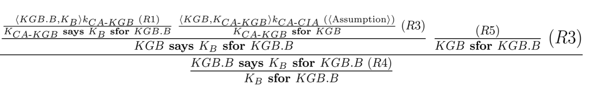
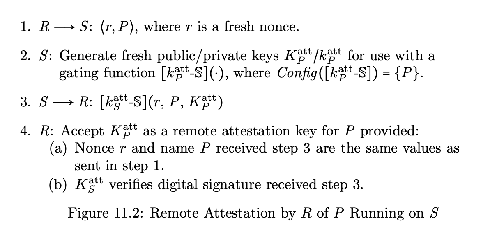

# introduction


# Authentication of Machines
## Symmetric Cryptosystems and Authentication
- Review of Shared Key Cryptography / symmetric key crypto
    - {m}k denotes E(k, m)
    - A -> B: m denotes 'A sends m to B'
    - A -> B: r, s, t denotes sending a msg comprising fields r, s, t
    - Dolev-Yao thread model
        - An attacker can intercept messages transmitted between hosts.
        - An attacker can parse any message comprising separately encrypted fields, and the attacker can extract the separate fields. 
        - An attacker can decrypt a message or field if and only if that attacker has previously obtained the appropriate encryption key. 
            - first 3 elements characterize passive attacks
        - An attacker can construct and send new messages using information intercepted from old messages.
            - active attacks
- Uses of Shared Key Cryptography
    - if A and B share key k
        - A -> B: {m}k
    - confidential information might temporarily reside unencrypted on the disk
- Authentication using Shared Key Cryptography
    - authentication protocol 
        - allows a principal receiving a message to determine which principal sent that message
    - weak authentication   
        -  a principal must reveal the secret in order to prove knowledge of that secret
        - subject to replay attacks
    - strong authentication
        - knowledge of the secret is demonstrated without revealing the secret itself
        - e.g. diff challenge every time
    - protocol allows B to authenticate A
        - assume A and B share a secret key
        - 
            ```
            1. B: select and store a new random value r (nounce).
            2.B-->A: B,r #inclusion of 'B' allows receiver A to select the correct shared key 
            3.A-->B: {r}k
            4. B: check whether D(k, {r}k) equals the stored value r from step 1.
            ```
    - reflection attacks
        - A and B are each unwittingly running an "encryption service"
        - an intruder sends information from an on-going protocol execution back to the originator of that information.
        - intruder runs one or more concurrent instances of the protocol and interleaves them with the original.
        - 
            ```
            1. B:  select and store a new random value r.
            2. B --> T:  B,r
                i.  T --> B:  A,r
                ii.  B --> T:  {r}k
            3. T --> B: {r}k
            4. B:  check whether D(k, {r}k) equals the stored value r from step 1.
            ```
        - could be prevented by breaking protocol symmetry
            - e.g. have k_AB and k_BA, where k_AB is used by B when A is the initiator
        - Insist that each response includes the identity of the responder
            - ``3. A --> B:  {A,r}k``
    - man-in-the-middle attacks
        -  T could run two instances of the protocol: 
            - one with A and the other with B
            - engaging as needed whichever of these principals would produce the value being needed by T to perpetuate its deception.
        - 
            ```
            Each protocol step i of the form
                i. X --> Y: m
            is replaced by two steps
                i. X --> T: m
                i' T --> Y: m
            ```
        -  T is indistinguishable from a wire or a network channel
            - which itself might involve multiple store-and-forward routers
    - two compelling reasons for principals to share keys
        - shared keys can be used to implement string authentication
        - shared keys help in defending against man-in-the-middle attacks.
- Key Distribution Protocols
    - need mediated key exchange protocol, else O(N^2) number of keys
    - Each host shares a key with some trusted host KDC (for Key Distribution Center)
    - KDC generates keys, on demand, for pairs of hosts that must communicate.
    - protocol
        - Assume each principal P shares key K_P with KDC.
        - 
            ```
            1. A --> KDC: A,B
            2. KDC --> A: A,B, {K_AB}K_A 
            3. KDC --> B: A,B, {K_AB}K_B
            ```
        - problem
            - A does not know whether B has received the key
        - fix
            ```
            1. A --> KDC: A,B
            2. KDC --> A: A,B, {K_AB}K_A, {K_AB}K_B 
            3. A --> B: A,B, {K_AB}K_B
            ```
        - man-in-the-middle attacks
            ```
            1. A-->T: A,B
            1' T --> KDC: A,T
            2. KDC --> T: A,T, {K_AT}K_A, {K_AT}K_T
                T --> KDC: T,B
                KDC --> T: T,B {K_TB}K_T, {K_TB}K_B 
            2' T --> A: A,B, {K_AT}K_A, {K_TB}K_B
            3. A --> B: A,B, {K_TB}K_B
            ```
        - fix
            ```
            1. A --> KDC: A,B
            2. KDC --> A: {A,B, K_AB, {K_AB}K_B}K_A 
            3. A --> B: A,B, {K_AB}K_B
            ```
        - replay attack
            - message 2 can be replayed by an attacker having intercepted message 1
            - forcing A & B to use an older value of K_AB
            - attacker with an old value of K_AB has incentive to make this happen
        - include nounce r to defend
            ```
            1. A --> KDC: A,B,r where r is a new random value 
            2. KDC --> A: {A,B,r, K_AB, {A,B,K_AB}K_B}K_A
            3. A --> B: A,B, {A,B,K_AB}K_B
            ```
        - Needham-Schroeder Protocol:
            - defend against B being fooled into using an old value of K_AB 
            - adding a challenge-response round to the end of the protocol
                ```
                1. A --> KDC: A,B,r where r is a new random value 
                2. KDC --> A: {A,B,r, K_AB, {A,B,K_AB}K_B}K_A
                3. A --> B: A,B, {A,B,K_AB}K_B
                4. B --> A: {r'}K_AB where r' is a new random value 5. A-->B:{r'+1}K_AB
                ```
            - two cases
                - Suppose the attacker replays an (old) message 3---a message containing an old value of K_AB known to the attacker. But in this case, the attacker would be able to respond to challenge 4, so B is fooled despite adding the challenge-response protocol (messages 4 and 5). (In Kerberos this problem is minimized by including a timestamp in the final field of message 2. B rejects a message 3 that contains a sufficiently old timestamp.)
                - What if the attacker does not know the old value of K_AB that is contained in the old message 3 being replayed? Here, the challenge will not succeed, but the attacker has caused delay and network traffic. On a positive note, B does learn that a shared key has not been established.
- Reality Intrudes: Keys do get compromised
    - The Otway-Rees authentication protocol avoids the above vulnerability
        ```
        1. A --> B: n,A,B, {r1,n,A,B}K_A
        2. B --> KDC: n,A,B, {r1,n,A,B}K_A, {r2,n,A,B}K_B 
        # checking that the same value for n appears in the two requests.
        3. KDC --> B: n,{r1,K_AB}K_A, {r2,K_AB}K_B,
        4. B --> A: n,{r1,K_AB}K_A
        ```
    - there is a nested structure (A; B; KDC; B; A) with Otway-Rees whereas with Needham-Schroeder, A is more of a hub, communicating separately with KDC and with B.
    - KDC can check message 2 to ensure that nonces r1 and r2 are being associated with the same protocol run nonce n, and (because KDC is trusted) send message 3 only if that equality holds.
- type attacks
    - len(n, A, B) = len(K_AB)
    ```
    i. T intercepts Otway-Rees message 1, and extracts substrings "n,A,B" and "{r1,n,A,B}K_A".
    ii. T blocks Otway-Rees protocol message 2 (which means message 3 won't be sent either).
    iii. T then sends back to A as Otway-Rees protocol message 4 the following (which is constructed from information learned by T in step i of this attack): 4. T --> A: n,{r1,n,A,B}K_A
    iv. A will decrypt {r1,n,A,B}K_A believing this bitstring to be {r1,K_AB}K_A. According to the correspondence we assumed above, A will conclude that K_AB equals "n,A,B".
    v. But T knows "n,A,B" from step i of the attack, so T has forced A to accept as a key K_AB shared with B what in fact is a key shared with T
    ```
    - prevented if mix-and-match substitution of different kinds of values is impossible
        - Use of a programming notation in which messages contain typing information is one way to avoid the problem.
- Back to Needham-Schroeder...
    - investigate the consequences of having the key K_A that a principal A shares with KDC compromised.
    ```
    i. Suppose T has intercepted message 2 from an earlier run of Needham-Schroeder where intercepted key K_A was in use. This means that T can extract the value of shared key K_AB being proposed in that message and also can extract "{A,B,K_AB}K_B".
    ii. T now waits for A to start a new execution of Needham-Schroeder to establish a shared key with B. T replaces message 3 in that execution with a message it constructs using "{A,B,K_AB}K_B" that T extracted in step i and that includes old key K_AB.
    iii. Because T knows this old value of K_AB (from step i), T can respond correctly to the challenge that B then sends in Needham-Schroeder message 4. So B will be convinced that this old value of K_AB is the new key it shares with A.

    ```
    - fix: have B create a nounce r''
        ```
        a. A-->B:A,B
        b. B --> A: A,B,r"
        1. A --> KDC: A,B,r,r"
        2. KDC --> A: {A,B,r, K_AB, {A,B,K_AB,r"}K_B}K_A
        3. A --> B: A,B, {A,B,K_AB,r"}K_B
        4. B --> A: {r'}K_AB where r' is a new random value 5. A-->B:{r'+1}K_AB
        ```

## Kerberos
- Key Management
    - Employing a KDC requires O(n) keys: a shared key K_A between every host A and the KDC. 
    - disadvantages of KDC-based system
        - the need for a protocol
        - the need to trust the KDC
        - the fact that KDC itself becomes a performance bottleneck.
- kerberos
    - key distribution facility designed at MIT to manage networks of workstations and servers.
    - a tendency for people to leave a workstation 'alone' while they were still logged in. 
    - how it works
        - user logs into workstation, and provides username and password
        - workstation uses the username and password to obtain credentials that are used by processes to access remote resources on behalf of the user
        - session = unit of certification is a 
        - A session is the period of time from logon to logoff at a given workstation.
    - workstation uses a session key instead of a master key or password
    - workstations erase the master key as soon as possible
- kerbero protocols
    - logging on to the network
        - A is a person
        - WkStation_A is a computer owned by A
        - K_A is the master key for A
        - KDC is a server.
    - protocol
        ```
        A --> WkStation_A:  A wishes to login.

        WkStation_A --> KDC:  A needs TGT

        KDC:   invent fresh session key S_A
            lookup K_A in local database
            TGT := {A , S_A , expTime}K_KDC

        KDC --> WkStation_A:  { S_A , TGT }K_A

        WkStation_A --> A:  Password?

        A --> WkStation_A:   Password is: xxxxxx

        WkStation_A:  Derive K_A from Password  xxxxxx
                    Extract S and TGT from "{ S_A , TGT }K_A" received earlier
                    Forget K_A at WkStation_A

        ```
    - period of significant vulnerability   
        - while the workstation is storing K_A (after asking for the password)
    - relevant state is encoded in the TGT
        - KDC does not need to remember any state 
    - Suppose that A would like to get credentials for a resource B
        ```
        A --> WkStation_A:  A wishes to access service B.

        WkStation_A --> KDC:  A, B, TGT

        KDC:  invent fresh key K_AB
            extract S_A from TGT found in message from WkStation_A
            Tick_B := {A, B, K_AB, expTime}K_B

        KDC --> WkStation_A:  {B, K_AB, Tick_B}S_A
        ```

        ```
        WkStation_A --> B:   Tick_B, {timeNow}K_AB #authenticator

        B:  extract A, B, K_AB, and expTime from Tick_B (since B knows K_B)
            abort unless timeNow < expTime

        B --> WkStation_A:  {timeNow+1}K_AB
        ```
        - From this second authenticator, A can determine that whoever sent the massage knows K_AB
            - thus was able to decrypt Tick_B, thus knew K_B and thus had to have been B.
        - does not prevent a 'replay' of a current request
            - B should keep all the requests for the last 5 minutes
            - check that all the requests from a given source are for different times.
- Engineering Issues in Kerberos
    - one master KDC and n slave copies that contain read-only copies of the data. 
        - data can be transferred from the master to slave KDCs without additional encryption 
    - KDC in a large network
        - partition the network (namespace) into realms
        - have a separate KDC for each realm.

## Public Key Certification Authorities
- certification authority (CA)
    - A service is needed that will provide a binding between a principal's name and public key
    - to trust that this binding is correct, the service (CA) signs the representation of the binding
    - public key of CA well-known
        - anyone could verify the signature
    - two functions
        - certify bindings (i.e. certification)
        - store the certificates.
- certificate revocation list (CRL)
    - need a scheme to assert that a certificate that has not yet expired is no longer valid
    - assign a unique serial number to each certificate
    - maintain CRL
    - {time of issue, revoked serial number, revoked serial number, ...}CA
    - A certificate is considered invalid if 
        - the expiration date has expired
        - or the serial number of the certificate appears on a recent CRL.
    - small expiration time 
        - certificates will be constantly reissued and lots of traffic will be generated
    - large expiration time 
        - long CRLs
-  how does a principal in one CA's domain get a public key for a principal in a different CA's domain?
- Privacy Enhanced Mail (PEM)
    - have a CA for each subtree of the namespace
        - a CA named A/B/C is responsible for all names of the from A/B/C/* 
    - CA at the root is too sensitive. 
        - Compromising A's private key in the above example would compromise everything below A
- Internet Policy Registration Authority (IPRA)
    - 3 classes of PCA (Policy Certificate Authorities)
        - High assurance 
            - Super secure with strict tests before issuing certificates to check identity
            - The same rules apply to all the CAs below the high assurance PCA in the subtree.
        - Discretionary assurance 
            - Well-managed at the top level
            - but no rules are imposed on organizations that are certified below the top level.
        - No assurance 
            - No statement can be made about the authority of this PCA.
- Pretty Good Privacy (PGP)
    - each user is responsible for maintaining their own set of public keys on a key ring
    - Users decide for themselves who to trust.
    - asks each user to assign a "trust rating" to each public key that is on the user's public key ring.
        - valid
            -  the user believes that the key is associated with whom the user was told it is associated with
        - trust
            - a measure of how much the user trusts the principal as a signer
            - none
            - partial
            - complete
    - key valid if  
        - certificate is signed by a principal the user completely trusts
        - certificate is signed by two partially trusted users

## Certificate Authorities: Reasoning about cross-linked CA's
- CA stores bindings from principal names to public keys (certificates)
    - <A, K_A>k_CA
    - <G, K_G>k_CA
    - anyone with access to 𝐶𝐴’s public key can check the signature
    - assuming that k_CA is never compromised
- From a Single CA to Multiple Cross-linked CA’s
    - multiple CAs
    - CIA
        - <A, K_A>k_CA-CIA
        - <KGB, K_CA-KGB>k_CA-CIA
    - KGB
        - <B, K_B>k_CA-KGB
    - suppose A wants to learn B's public key
    - chain of certificates
        - A has K_CA-CIA
        - A retrieves <KGB, K_CA-KGB>k_CA-CIA from the CIA database
        - A retrieves <B, K_B>k_CA-KGB from the KGB database
        - A uses K_CA-KGB to check that she can trust <B, K_B>k_CA-KGB
        - now A can use K_B
- definitions
    - Principals can say things
        - Principals only say things that they believe
        - a set w(P) defined to be the set of statements (propositions) that P believes
        - also known as the worldview of P. 
        - So P says m holds if and only if m \in w(P) holds.
    - Principals may “speak for” (sfor) other principals 
        - e.g. a keyboard on which A is typing is a principal and that principal speaks for A
        - Henceforth let A sfor B mean that A “speaks for” B, or A => B
        - A sfor B iff w(A) \subset w(B)
        - anything A says, B says, too
        - a keyboard in practice will say things that are completely independent of A, and thus, not a part of A’s worldview. 
            - thus keyboard cannot speak for 𝐴.
- formal inference rules for says and sfro
    - R1
        ```
        <m>k
        ------
        K says m
        ```
        - crypto key-pair (K, k) is being viewed as defining a principal
        - this principal is identified by its public key K
    - R2
        ```
        A sfor B, B sfor C
        -------------------
        A sfor C
        ```
        - follows from the transitivity of the \subset operator
    - R3
        ```
        A sfor B, A says X
        -------------------
        B says X/'

        ```
    - R4
        ```
        A says B sfor A
        ----------------
        B sfor A
        ```
    - R5
        ```
        A.n is a subprinciple of A
        --------------------------
        A sfor A.n
        ```
        - w(A) \subset w(A.n)
- 
    - <KGB, K_CA-KGB>k_CA-CIA
        - equivalent to K_CA-CIA says 'K_CA-KGB sfor KGB'

## Naming
- properties
    - use of one name does not prevent other names from being used
        - naming a file in the current directory shouldn't prevent you from naming a file in some other directory.
    - If an object does not have a name, then it is not accessible
        - A name is the only way to denote an object.
    - Singular objects do not require names.
        - e.g. in uniprocessor machines, the single processor was unnamed and referred to implicitly.
- purpose
    - sharing
        - Different entities can share an object through its name
        - If there are two or more processes accessing the same object
            - they can set up names and use them to denote the object
            - each entity could use a different name for the same object.
    - secrecy
        - In a large name space, usually only a small fraction of possible names are used.
        - it is not obvious what this fraction will be. 
        - e.g. password
- concerns
    - scalability
        - variable length names
            - The name space is potentially infinite.
        - unique names
            - The same name cannot be used to refer to two different object
            - Duplicate names would preclude controlled sharing and secrecy. 
        - no single central authority to produce names
            - a single authority becomes a performance bottleneck
            - a single point of failure
        - a manageable cost to produce new names
            - A distributed linear algorithm is usually not good enough.
    - hierarchical naming
        - indefinite growth in both directions
            - we can add either area codes or extensions to expand phone numbers.
            - distributed authority to create names
                - e.g. one authority would be in charge of names beginning with a/b/c
                - while another would be in charge of names beginning with a/b/d
                - if each authority maintains uniqueness in its sub-domain
                    - we will have global uniqueness of names
    - name information
        - names accompanied by hints
            - We must be able to access hints for a given name, 
            - if the hints are stale, we must be able to correct them.
        - impure names
            - a name is pure if there is no content in the name
            - An impure name contains attributes of the object it names. 
                - pros
                    - we can easily extract necessary information from the name itself
                - cons
                    - impure names have a built-in consistency problem
                    - when the information is no longer correct, the name must change
- binding
    - the association of name to object
    - names uttered with respect to a certain context
    - context maps names to objects
    - properties
        - The mapping is partial
            - only a small fraction of the name space is used.
        - The mapping is subject to change
            - happens slowly and infrequently
            - E.g., after a file is edited, the same file name now refers to a different bit stream.
        - The domain of the context is interesting. 
            - We enumerate the names in a domain or sub-domain when we need to create new, unique names.

## Measured Principals and Gating Functions
- measured principal definiting characteristics
    - binary being executed
    - initialization data read
    - the name of a measured principal that is providing the execution environment
- gating function
    - [K-F](*)
    - Key K can be used only by gating functions [K-F](⋅) naming K. Other accesses to K are blocked.
    - invocations of K-F(⋅) succeed only in systems satisfying an associated configuration constraint Config([K-F])
        - which is a set of measured principals that must have started executing.
    - enforce a form of authentication-based access control
        - where binary executables and their run-time environments are being authenticated.
        - an invocation of [K-F](⋅) requires that the measured principals in Config([K-F]) have started executing,
        - the name of a measured principal can be associated with properties that we believe will be satisfied by that principal’s executions.
    - Confidentiality can be enforced by using encryption.
    - Integrity can be protected by using digital signatures, message authentication codes, or authenticated encryption

### Measured Principal Descriptions
- measured principal's name N(D)
    - derive from description D = d1, d2, ..., dn
    - changing any of the descriptos result in a enw description D'
    - each descriptor di is derived from some resource at the time of first access by the measured principal being named
    - descriptors are listed in order of first access by the measured principal being named.
    - examples of resources
        - hardware processors
        - input/output devices
        - executables
        - regions of storage
        - files.
- Completeness of Descriptions
    - more-complete description for a measured principal P can facilitate blocking attacks embedded in a modified version P′ that masquerades as P.
    - The different name would cause gating functions to block P' from using the cryptographic keys that P is using

### Naming Schemes for Measured Principals
- attacker can control the order resourced are accessed
    - can control description for the resulting measured principal
    - but infeasible to predict the name N(D) assigned to MP
- properties of func N()
    - collision resistance
        - if D != D', then N(D) != N(D') holds with high probability
    - preimage resistance
        - given D, infeasible to construct D' such that D != D' and N(D) = N(D')
    - N(D) = 
        - 0 if D = \empty
        - H(N(d1, ..., d_{n-1}) * H(d_n)) if D = d1, ..., dn 
-  if N (DP) = N_P holds and the integrity of name N_P is trusted 
    - then DP can be trusted, too.
- Descriptor Details
    - Descriptors for Programs and Data
        - a descriptor dO for an object O should be a collision and preimage resistant function of the bit string B_O that is representing O
        - cryptographic hash H( BO ).
        - <ARM_O, AID_O>
            - ARM_O is an address-relocation map
            - AIDO is an address-independent description
    - Descriptors for Hardware Processors.
        - If each hardware processor hw has a unique name N (hw) then use H(N (hw)) as the descriptor d_hw
        - if each hardware processor provide a read-only register that contains a unique name for use in forming the processor’s descriptor 
            - easy to subvert
        - deriving a name N(hw) for a hardware processor hw from a unique signing key k^id_hw that hw stores, uses but never reveals
        - N(hw) K^id_hw
        - qkr_id comes preloaded with k^id_hw
            - this register cannot be accessed except by executing instruction ``quote(qkr_id, r, out)``
            - computes k^id_hw-S(r)
            - writes value into memory out
        - if r is fresh, AuthHW(K, r) returns true
            - then N(hw) = K
            - underlying processor has name K.
        - 
            ```
            AuthHW : function(K, r) 
                quote(qkr_id , r, out )
                if K-S?(out)
                    then return( true )
                    else return( false ) 
                end AuthHW
            ```
        - k_C-S(K^id_hw speaksfor ISA_hw)
            - C is the processor's manufacturer, or some trusted party
            - K_C well known
            - ISA_hw is a subprincipal of C
            - attacker would not be able to create an instance of certificate for a public key K chosen by the attacker.
        - additional names for hardware processor
            - otherwise might reveal whether two measured principals are sharing a processor
            - processor hw to have one or more attestation identity keys
                - each a surrogate for K^id_hw
                - validity of attestation identity key K_hw^A
                    - k_T-S(K_hw^A speaksfor ISA_hw)
                    - signed by some trusted third-party T
                    - K_T well known
                    - generated by T in response to a request
                        - k_C-S(K^id_hw speaksfor ISA_hw)
                        - k^id_hw-S(K^A_hw speaks for K^id_hw)
    - descriptors for properties
        - various implementations
            - A signed certificate from a trusted organizatio
                -  where the contents identifies the property that is purported to hold.
            - The output of an analyzer
- auxiliary information
    - requirements for Aux_i
        - identification and retrieval of the objects involved in calculating descriptor d_i,
        - recalculation of d_i from those objects, and
        - assessment of whether those objects should be trusted.
    - Checking Integrity of Auxiliary Information
        - check N_P = N(D_P)
        - for each d_i in candidate description D_P, check integrity of associated aux info Aux_i
            - obtain copies of associated resources
            - use copies to compute a descriptor d_i', and compare d_i' with d_i
### Hardware Support for Gating Functions
- idealized embodiment
    - Instructions to update measurement registers
        - All but one of the measurement registers is reset whenever the processor reboots
        - used for defining configuration constraints.
    - instructions to generate fresh crypto keys, store keys in key registers
        - values stored in key registers persist across reboots
        - sealing-key registers skr_1, ..., skr_N
        - quoting-key registers qkr_id, qkr_1, ..., qkr_N
        - unbinding key registers ukr_1, ..., ukr_N
    - instructions that use a key K in a specified key register, and compute a gating func [K-F](*) to perform
        - sealingprotect the confidentiality and integrity of local content,
        – quoting to establish authenticity of locally produced content, or
        – binding to import remote content but only if the local system satisfies certain configuration constraints,
        - Config([K-F]) defined in terms of measurement register contents
    - confidentiality of crypto keys is protected
        - unencrypted keys never leave key registers 
        - instructions that use the contents of a key register are computing cryptographic functions that, by design, reveal nothing about the key.
    - mr have to return to the values they had before the reboot
        - same set of measured principals running after the reboot as before the reboot
- Measurement Registers and Constraints
    - mr_0 automatically incremented each time the system reboots
    - create ephemeral key
        - include this counter in a configuration constraint
        - a key that becomes unusable after a reboot occurs.
        - defend against TOCTOU (time-of-check, time-of-use) attacks
            - an attacker instigates a reboot to load and start malware that will run in place of principals
                - that had been authenticated by some remote service
            - causing the remote service to confuse messages from the malware with messages being from the authenticated principals
    - system mode instructions MRreset & MRextend updates mr_1, ..., mr_N
        - MRreset(mr_i)
            - mr_i := 0
        - MRextend(mr_i, mem)
            - mr_i := H(mr_i * H(mem))
            - `mem` denotes the contents (not the address) of some memory region
            - making mr_i ideally suited to storing names of measured principals.
    - configuration constraints
        - specified by listing a subset of the mr and a value it must store
            - C = {...,<i, v_i>}
            - \Wedge_{<i, v_i> \in C} mr_i = v_i
        - C is satisfied during execution iff. 
            - current values of the measurement registers that C mentions agree with the values C prescribes
            - ConfigSat(C): <i, v_i> \in C => mr_i = v_i
        - chain of trust
            - follow execution back througj the OS, boot-loader, firmware, ...
- Seal and Unseal
    - definitions
        - gating func to convert between unsealed bit strings and K/C-sealed bit strings
        - K is a symmetric key
            - stored in sealing-key register
        - C is config constraint
        - Reading a K/C-sealed bit string `sb` reveals nothing about K or about the unsealed bit string from which sb was derived.
        - Updates to a K/C-sealed bit string are not blocked but cause subsequent execution of unseal to fail.
            - availability of K/C-sealed bit string compromised by writing to it
            - but integrity is not compromised
        - SKRgen
            - SKRgen generates a fresh symmetric key
            - loads that key into an indicated sealing-key register
            - associates a configuration constraint defined by the current values of those mr selected by a bit string crSrt 
            - skr_i comprises two fields
                - skr_i.key = fresh symmetric key
                - skr_i.config = {<i, v_i> | crSet[i] \wedge mr_i = v_i}
    - seal(skr_i, in, out)
        - 
            ```
            out := skr_i.key-E^A(in)
            ```
        - gating func for shared-key authenticated encryption func K-E^A(*)
        - encryt info
    - unseal(skr_i, in, out)
        - 
            ```
            if ConfigSat(skr_i.config)
                - then out := skr_i.key-D^A(in)
                - else fail
            ```
        - gating func for shared-key authenticated decryption func K-D^A(*)
        - fails (instead of decrypt) if argument not produced by K-E^A(*)
    - By sealing the state that is being saved between executions of a given program or service
        - protect the confidentiality of that state from attackers
        — including across system reboots
- Sealed-State Upgrade Protocol
    - System invokes unseal
        - transform all sealed bit strings data into unsealed bit strings.
    - Perform software upgrade
        - Upgraded system is now executing and has access to unsealed bit strings generated in step 1.
    - Upgraded system resets then reloads measurement registers
        - reprovisions the sealing-key registers 
        - using configuration constraints that are defined using updated values in measurement registers
    - Upgraded system, using reprovisioned sealing-key registers
        - invokes seal to transform unsealed bit strings from step 1 back into sealed bit strings.
- Key archives
    - KRseal(skr_i, krSet, ska)
        - 
            ``  
            let keyArchive = {(j, v_j) | krSet[j] \wedge kr_j = v_j}
            in ska := seal(skr_i, keyArchive)
            ```
        - seals the contents of some specified subset of the key registers
        - including key and config constraint fields for each
        - stores in memory as key archive
    - KRunseal
        - 
            ```
            let keyArchive = unseal(skr_i, ska)
            in for (j, val_j) \in keyArchive do kr_j := val_j
            ```
        - restores those values to their original key registers
- quoting
    - A quoted bit string will have an unforgeable digital signature affixed
    - Quoting-key register qkr_id has a fixed value and has no associated configuration constraints
        - qkr_id.key = k^id_hw
            - k^id_hw is a unique signing key associated with the processor hw that hosts this register
        - qkr_id.config = \empty
    - verification key for checking digital signature & certificates are not secret
        - stored in memory
    - QKRgen(qkr_i, crSet, mem)
        ```
        qkr_i.config := {<i, v_i> | crSet[i] \wedge mr_i = v_i}
        let k/K be a fresh private/public key pair
        in qkr_i.key := key
            mem := qkr_id.key-S(qkr key: i | K)
        ```
    - quotre(qkr_i, in, out)
        ```
        if ConfigSat(qkr_i.config)
        then out := qkr_i.key-S(sig: i | in)
        else fail
        ```
        - has a diff prefix
    - retrieving config
        - To trust results produced by executing a gating function [K-F](*)
        - requires knowledge of the configuration constraint associated with the key register that stores K.
        - KRgetConfig(kr_i, r, out)
            ```
            out := qkr_id.key-S(keyCnfig:i | r | kr_i.config)
            ```
            - provides that information
            - stores into memory a k^id_hw-signed certificate for the config constraint associated with a specified key register
        - KRgetCurConfig reveals the current configuration
            ```
            cc := {<i, v_i> | i \in crSet \wedge mr_i = v_i}
            out := qkr_id.key-S(curCnfig: r | cc)
            ```
            - stoes into memory a k^id_hw-signed certificate giving the current values for any designated set of measurement registers
            - r defend against replay attacks
            - certificates includeing mr_0 in crSet
                - useful for defending attacks that replay outdated immutable data objects
                - including old descriptions of measured principals and old configuration constraints
- binding and unbinding
    - By encrypting some information under public key K
        - we are binding that information to the specific system that is able to use gating function [k-D](⋅) to invert that encryption.
        - [k-D](*) implements unbinding
    - Encryption under a public key can be performed by a remote processor
        - because public keys can be shared freely. 
        - location flexibility distinguishes binding from sealing. 
        - Sealing must be performed on the same processor as the unsealing
            - both operations must access the same key register
    - UKRgen(ukr_i, crSert, mem)
        ```
        ukr_i.config := {<i, v_i> | crSet[i] \wedge mr_i = v_i}
        let k/K be a fresh private/public key pair
        in ukr_i.key := key
        mem := qkr_id.key-S(ukr key: i | K)
        ```
    - UKRdec(ukr_i, in, out)
        ```
        if ConfigSat(ukr_i.config)
        then out := ukr_i.key-D(in)
        else fail
        ```

## Remote attestation

- remote attestation protocol returns to its initiator
    - the name P for a measured principal being executed by a remote host,
    - an attestation public key K^att_P for verifying signatures on messages digitally signed by P.

### A Remote Attestation Protocol
- 
- dependson following assumptions
    - R trusts S and has an attestation public key K^att_S that verifies signatures on messages digitally signed by S.
    - S is the environment that executes P. 
        - Thus, description D_S is a prefix of D_P and P = N(D_P)
    - S implements gating function [k^att_P-S](⋅) for generating digital signatures